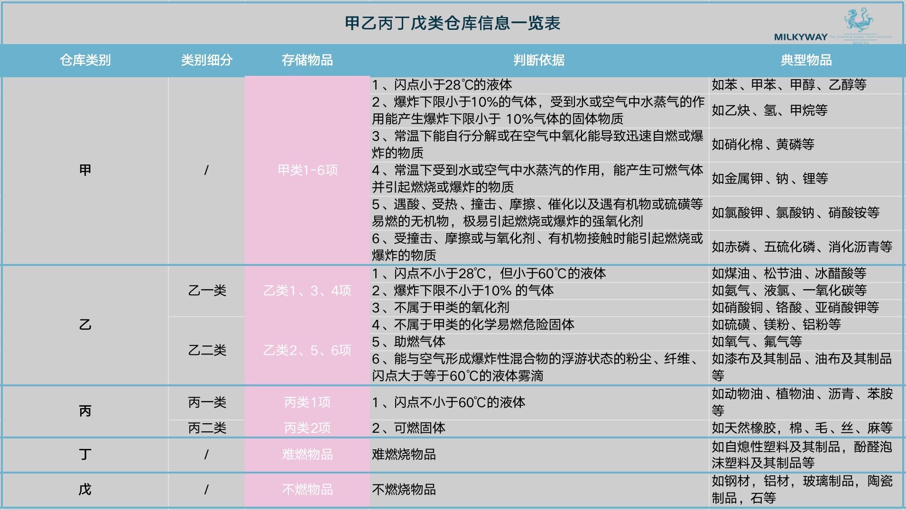
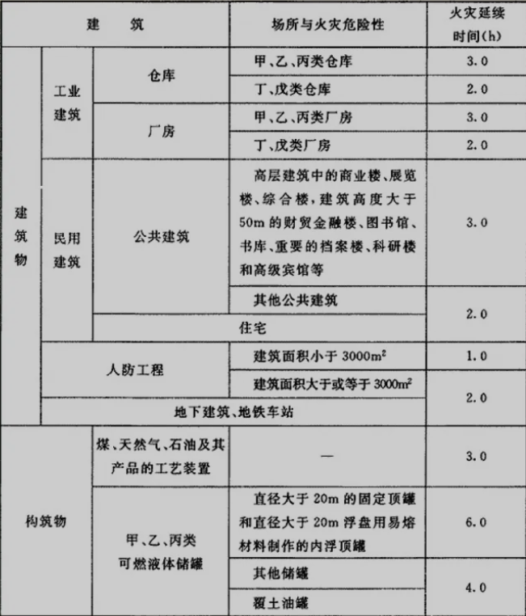
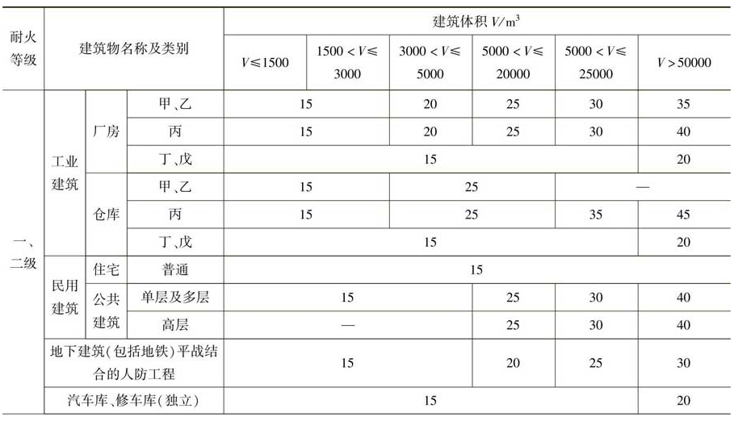
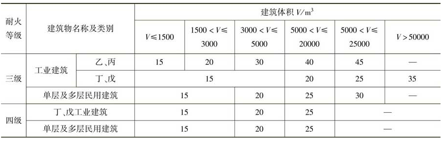
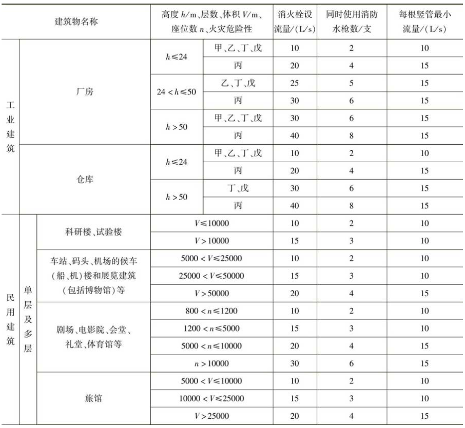
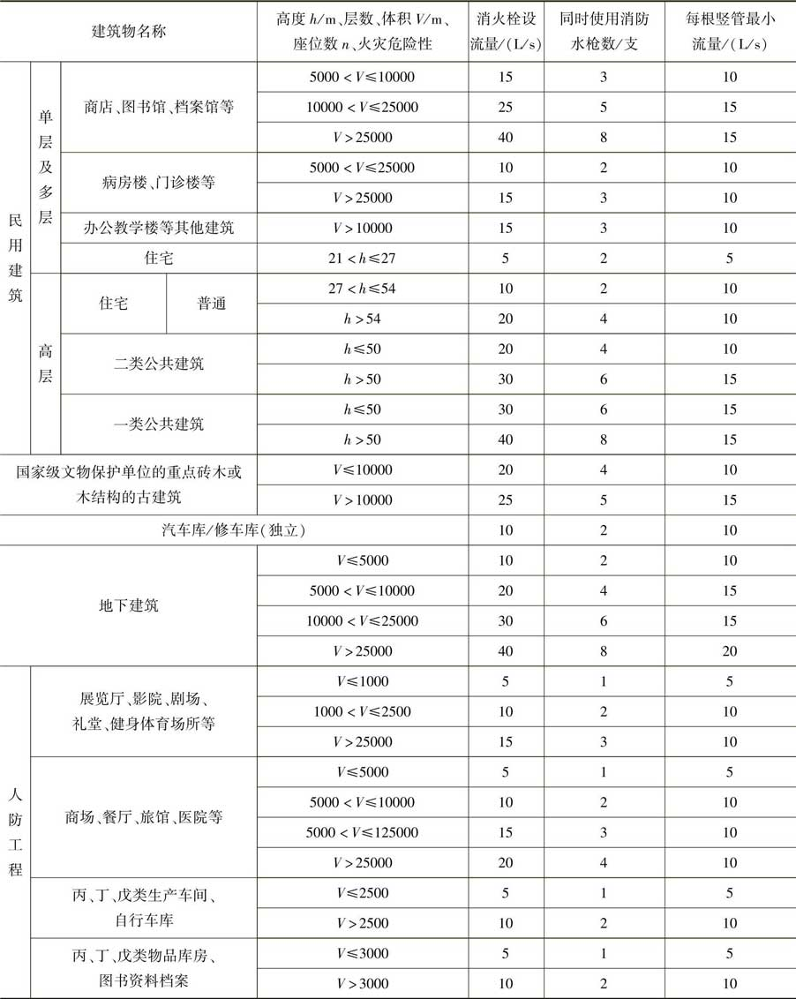

### 3 消防废水及消防水池有效容积计算

#### 3.1 甲乙丙丁戊厂房划分

#### 3.2 确定火灾延续时间

- 查文末附表1。
- 若为自动喷水灭火系统：$t_{y,自动喷水灭火系统}=1h$。
- 若为水幕系统：
- - 《消防给水及消火栓系统技术规范》3.6.4“建筑内用于防火分隔的防火分隔水幕和防护冷却水幕的火灾延续时间，不应低于防火分隔水幕或防护冷却设置部位墙体的耐火极限”。
  - 《建筑设计防火规范》5.3.2建筑内设置中庭时，其防火分区的建筑面积应按上、下层相连通的建筑面积叠加计算；当叠加计算后的建筑面积大于本规范第5.3.1条的规定时，应符合下列规定：
  - - 与周围连通空间应进行防火分隔：采用防火隔墙时，其耐火极限不应低于$1.00h$；
    - 采用防火玻璃墙时，其耐火隔热性和耐火完整性不应低于$1.00h$；
    - 采用耐火完整性不低$1.00h$的非隔热性防火玻璃墙时，应设置自动喷水灭火系统进行保护；
    - 采用防火卷帘时，其耐火极限不应低于$3.00h$。
  - **总结为：冷却水幕如果对防火玻璃墙进行冷却时，时间为$1.00h$，如果对防火卷帘进行冷却时，时间为$3.00h$。**

#### 3.3 消防水池有效容积计算公式

$$
消防水池有效容积=火灾延续时间内用水量-火灾延续时间内补水量
$$

##### 3.3.1 确定火灾延续时间内用水量

**①室外消火栓系统用水量**：

- 查文末附表2。
- 成组布置的建筑物应按消火栓设计流量较大的相邻两座建筑物的体积之和确定。
- 火车站、码头和机场的中转库房，其室外消火栓设计流量应按相应耐火等级的丙类物品库房确定。
-  国家级文物保护单位的重点砖木、木结构的建筑物室外消火栓设计流量，按三级耐火等级民用建筑物消火栓设计流量确定。
- 当单座建筑的总建筑面积大于$500000m^2$时，建筑物室外消火栓设计流量应按以上规定的最大值增加一倍。
- 根据水规范6.1.5当为水泵接合器供水时，距建筑外缘$5～40m$范围内的市政消火栓可计入建筑室外消火栓数量，当市政给水管网为支状时计入室外消火栓设计流量**不宜超过一个市政消火栓的出流量**。一只市政消火栓的设计流量为$15L/s$。

**②室内消火栓系统的用水量**：

- 查文末附表3。
- 当建筑物室内设有自动喷水灭火系统、水喷雾灭火系统、泡沫灭火系统或固定消防炮灭火系统等一种或两种以上自动水灭火系统全保护时，高层建筑当高度不超过$50m$且室内消火栓系统设计流量超过$20L/s$时，其室内消火栓设计流量可减少$5L/s$。
- 多层建筑室内消火栓设计流量可减少$50\%$，但不应小于$10L/s$。
- - 如果**直接给出**条件“室内消火栓设计流量”，不考虑折减的问题，直接用给出的数据计算。
  - 如果是**查表得出**“室内消火栓设计流量”为$xxL/s$时，就要去计算折减情况。比如，查表得出室内设计流量为$35L/s$，符合高层建筑折减时，最终按照$30L/s$确定。

**③自动喷水灭火系统的用水量**：

- 自动灭火系统包括自动喷水灭火、水喷雾灭火、自动消防水炮灭火等系统，一个防护对象或防护区的自动灭火系统的用水量**按其中用水量最大的一个系统确定**。
- 比如，题目中设置了湿式自喷，设计流量为$20L/s$；干式自喷设计流量为$25L/s$；水喷雾灭火系统设计流量为$35L/s$，防火卷帘冷却水幕系统设计流量为$40L/s$。则此时选取自喷系统时应选择$35L/s$（因为**水幕系统为冷却作用**，并不是灭火作用，选取时应该将灭火部分进行比较取最大值，而**冷却部分单独计算**）。

**④水幕系统的用水量。**
$$
火灾延续时间内用水量(m^3)\\=(室内消火栓+室外消火栓+自喷+冷却)设计流量(L/s)×火灾延续时间(h)×3.6
$$

##### 3.3.2 确定补水量

$$
火灾延续时间内的补水量(m^3)=补水流量(L/s)×火灾延续时间(h)×3.6
$$

- 在计算补水量时火灾延续时间应取计算过程中的最大值。
- 消防水池应采用**两路消防给水**，即：当补水管路为一路补水时，此时认为补水不可靠，则不考虑补水情况（即不减去该部分水量）。
- 当补水管路为两路补水时才可以将补水量减去，而补水设计流量采用**两路补水中相对流量较小值**；比如两路补水分别为$15L/s$和$10L/s$，那么计算补水量时的取值应取$10L/s$，来进行计算（因为要保证可靠）。
- 火灾延续时间内的连续补水流量应按消防水池最不利进水管供水量计算：

$$
q_{f}=3600A{\cdot}v
$$

- - $q_{f}$：火灾时消防水池的补水流量，$m^3/h$。
  - $A$：消防水池进水管断面面积，$m^2$。
  - $v$：管道内水的平均流速，$m/s$。
  - 消防水池进水管管径和流量应根据市政给水管网或其他给水管网的压力、入户引入管管径、消防水池进水管管径，以及火灾时其他用水量等经水力计算确定，当计算条件不具备时，给水管的平均流速不宜大于$1.5m/s$。

##### 3.3.3 消防废水

$$
V_{消防废水}=V=V_{p}
$$

- $V_{消防废水}$：消防废水总量，$m^3$。
- $V$：消防水池总容积，$m^3$。
- $V_{p}$：火灾延续时间内用水量，$m^3$。

##### 3.3.4 消防水池有效容积

$$
V_{a}=V_{p}-V_{b}=V-V_{b}
$$

- $V_{a}$：消防水池有效容积，$m^3$。
- $V_{b}$：火灾延续时间内的补水量，$m^3$。

------

### 附表1

### 附表2

### 附表3

