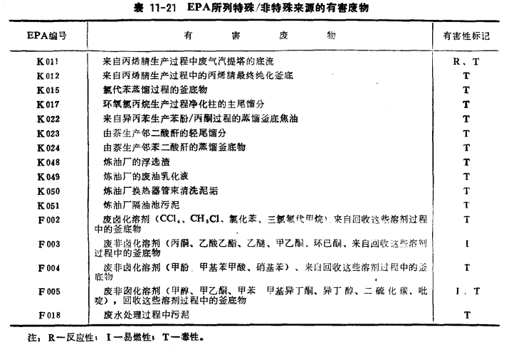

### 5.3 环境参数检测（三）废渣

#### 5.3.1 石油化工企业主要有害固体废弃物

#### 5.3.2 固体废弃物有害特性鉴别方法

- **急性毒性的初筛试验方法**：采用pH为$5.8～6.3$的水，与样品混合（固液比为$1:1$），于室温下浸泡$24h$，制备浸出液。对白鼠进行一次性灌胃，进行中毒症状观察，并记录$48h$内的死亡数
- **易燃性的试验方法**：采用“石油产品闪点测定法（闭口杯法）”进行测定。
- **腐蚀性的试验方法**：
- - 对液态、稀泥或浆状物料，可直接插入电极，进行pH值的测量。
  - 对粘稠状物料，可高速离心后，测定其液体部分的pH值。
- - 对粉、粒、块状物料，用新鲜蒸馏水提取（固液比为$1:5$）后，测定上层清液的pH值。

- **反应性的试验方法**：根据外界条件的不同，又可分为：
- - 撞击感度测定法：在立式落锤仪上进行。
  - 磨擦感度测定法：在磨擦感应仪上进行。
  - 差热分析测定法。
  - 爆发点测定法。
  - 火焰感度测定法。

- **遇水反应性的试验方法**：实际上是一个观察温升的过程。但是，必须同时观察发生气体的情况，并同时测定气体的成分。
- **浸出毒性试验**：制备浸出液，然后进行成分的分析。

#### 5.3.3 固体废弃物中重金属含量测定

- **重金属的提取**：
- - 用**各种酸及其混合物溶解**样品，对大多数废渣是有效的，当废渣中含有相当量的有机物质时，应将有机物破坏或分解成有关元素的无机化合物，然后再进行测定。混酸实际上也是一种氧化剂，其它氧化剂可选用过硫酸钾、过氧化氢、碘酸、重铬酸钾等。
  - 将样品与固体试剂**加热熔融**，以得到合乎分析要求的溶液，这种方法的温度高扩大了溶出样品的范围，对催化剂废渣中贵重金属的提取，也是一种普遍的方法。
  - 固体废弃物的分析中，样品溶出是较困难的一个步骤，而且由于使用强酸、强碱、强氧化剂，提取过程中又有溶解产物的挥发及消化试剂的分解。因此，近来**封闭加压**的方法得到了较快的发展。
  - 还有一种**氧弹法或氧瓶法**。将物料放入一钢弹（或耐热玻璃瓶）中，充以纯氧（也可以是其它氧化性气体，如二氧化氮、氯气等），用电火花引爆，分解产物则可吸收于适当的溶液中。

- **重金属含量测定**：当含量低时，一般可采用原子吸收分光光度法、光度法和极谱法等，而在含量高时，则一般采用氧化还原或络合滴定法。

| 序号 | 测定元素 | 分析方法                                                     |
| :--: | :------: | ------------------------------------------------------------ |
|  1   |    汞    | （1）冷原子吸收法。 （2）冷原子荧光法。 （3）双硫腙光度法。 |
|  2   |    镉    | （1）原子吸收分光光度法。 （2）极谱法。 （3）新镉试剂光度法。 （4）EDTA滴定法。 |
|  3   |    砷    | （1）Ag-DDC。 （2）新银盐光度法。 （3）原子吸收分光光度法。 （4）铈滴定法。 |
|  4   |    铬    | （1）二苯碳酰二肼光度法。 （2）原子吸收分光光度法。 （3）硫酸亚铁铵容量法。 |
|  5   |    镍    | （1）原子吸收分光光度法。 （2）丁二酮肟光度法。          |

- **有机成分的测定**：
- - 如果是为了**利用废渣中有机物的热能**：
  - - 含水量测定：可用类似于测定石油产品中水分的方法进行，即用苯提取油品中的水分，在一特别的量管中测量。对于粉、泥状的废渣，可先用脱水的煤油，将废渣搅成糊状。对不含轻质油品的废渣，则可用类似于土壤水分的测定方法进行。
    - 含油量测定：用四氯化碳抽提一定量的废渣，然后用类似于水体中石油类物质的测定方法进行。为了抽提完全，亦可在脂肪提取器中进行，但当含油量较大时，似无必要。
    - 有机质量测定：本方法类似于水体中化学耗氧量的测定方法，即在加热条件下，用一定量的标准重铬酸钾-硫酸溶液来氧化废渣中的有机质，然后用标准的硫酸亚铁铵来回滴剩余的重铬酸钾。
    - 热值测定：测定废渣热值的目的，在于获得废渣在用作某种燃料的可能，或者是当焚烧处理废渣时，需补充加入的燃料量。发热值的测定比较麻烦，具体的设备特点、操作程序和计算方法可参考煤的发热量测定方法（GB2B-63）。
  - 如果是为了**了解废渣中有毒有机物的种类及含量**：
  - - 需要测定一些特殊的有机物。实际上，测定的方法和污水的测定方法是相同的，其关键则在于将这些待测的有机物从固体上转移到溶剂相中。
    - 一般可用水，或是酸化（碱化）的水进行提取，然后用有机溶剂（苯、四氯化碳、石油醚等）将水中的有机物再萃取到溶剂相中，继续进行分析。有时，也可以直接用有机溶剂将待测物质从废渣上提取出来

<table>
	<tr>
		<th colspan=3 style="text-align:center">固体废弃物中有机毒物的分析</th>
	</tr>
	<tr>
		<td style="text-align:center">名称</td>
		<td style="text-align:center">提取方法</td>
		<td style="text-align:center">分析方法</td>
	</tr>
	<tr>
		<td style="text-align:center">酚类化合物</td>
		<td style="text-align:left">氯仿直接提取</td>
		<td style="text-align:left">气相色谱法（FID）PBOB为固定液</td>
	</tr>
	<tr>
		<td style="text-align:center">硝基苯 混化合物</td>
		<td style="text-align:left">水提取，再用甲苯萃取水相中的硝基苯</td>
		<td style="text-align:left">气相色谱法（ECD）OV-225为固定液</td>
	</tr>
</table>