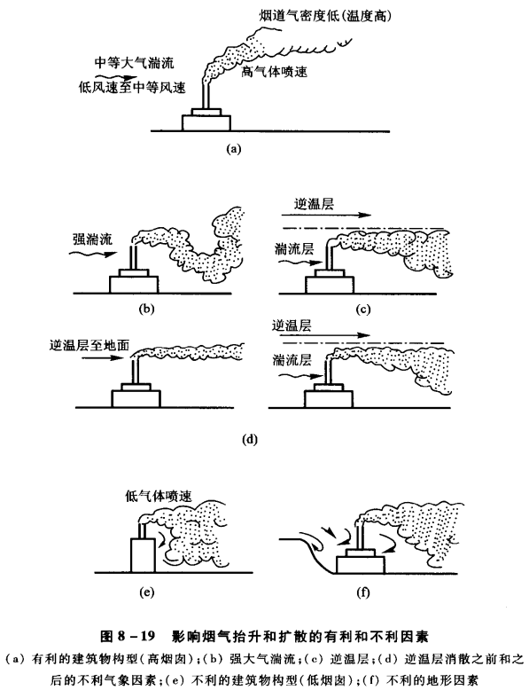

### 6.2 污染物落地浓度计算（二）烟气抬升高度

#### 6.2.1 烟气抬升高度及其影响因素

- 通过烟囱排出的烟气通常都具有一定的速度和温度。在动力及浮力作用下，烟气在离开烟囱口以后，仍然要向上冲出一定的高度，然后再沿风的方向扩散。
- 烟气在水平方向的扩散称为烟羽。烟羽轴线与烟囱口间的距离称为烟羽抬升高度$\Delta{H}$。烟气所达到的高度称为有效源高，因此，有效源高度$H$（m）等于烟囱实体高度$H_{s}$（m）与烟气抬升高度$\Delta{H}$（m）之和，即：

$$
H=H_s+\Delta{H}\tag{2-1}
$$

- 对于一般的烟囱，$H_{s}$为一定值。因此，只要计算出$\Delta{H}$，有效源高就可随之而定。

- 影响烟气抬升和扩散的因素主要是排放因素、气象因素及下垫面状况：
- - 排放因素：烟流喷速和烟气温度。
  - 气象因素：平均风速（$\overline{u}$）、湍流强度、环境空气温度、大气稳定度以及逆温层等。
  - 下垫面状况：主要是指地形及建筑物构型。

- 图8-19（a）：烟流喷出速度愈快或烟气温度与周围空气温度之差越大，在中低风速下，烟气抬升高度越大。
- 图8-19（b）：平均风速越大，湍流越强，空气与烟气的混合就越快，此时温度和动量就迅速减小，抬升就小。
- 图8-19 （c）和（d）：逆温层及逆温层消散前后的不利气象因素阻止烟流的抬升，因而烟气向地面扩散。
- 图8-19（e）和（f）：不利的工厂因素和地形因素引起烟流下沉，影响烟流抬升。

#### 6.2.2 烟气抬升高度的计算公式

##### 6.2.2.1 我国国标（GB3840-83）推荐公式

- 当$Q_{h}≥500{\times}4.18kJ/s$时，有：

$$
\Delta{H}=n_{0}Q_{h}^{n_{1}}H_{s}^{n_{2}}{\overline{u}}^{-1}\tag{2-2}
$$

$$
Q_{h}=0.35p_{a}Q_{v}\frac{\Delta{T}}{T_{s}}\tag{2-3}
$$

$$
\Delta{T}=T_{s}-T_{a}
$$

- $n_{0}$：烟气热状况及地表系数，见表2-1。
- $n_{1}$：烟气热释放率指数，见表2-1。
- $n_{2}$：排气筒高度指数，见表2-1。
- $Q_{h}$：单位时间内排出烟气的热量，$kJ/s$。
- $H_{s}$：排气筒距地面几何高度，m，超过240m时，取$H_{s}=240m$。
- $p_{a}$：大气压力，kPa，如无实测值，可取邻近气象台（站）季或年平均值。
- $Q_{v}$：实际排烟率，$m^3/s$。
- $\Delta{T}$：烟气出口温度与环境温度差，K。
- $T_{s}$：烟气出口温度，K。
- $T_{a}$：环境大气温度，K，如无实测值，可取邻近气象台（站）季或年平均值。
- $\overline{u}$：排气筒出口处平均风速，m/s。

<table>
	<tr>
		<th colspan=5 style="text-align:center">表2-1 n0、n1、n2的选取</th>
	</tr>
	<tr>
		<th style="text-align:center">Qh/(kJ/s)</th>
		<th style="text-align:center">地表状况（平原）</th>
		<th style="text-align:center">n0</th>
		<th style="text-align:center">n1</th>
		<th style="text-align:center">n2</th>
	</tr>
    <tr>
    	<td rowspan=2 style="text-align:center">Qh&gt;5000</td>
    	<td style="text-align:center">农村或城市远郊区</td>
    	<td style="text-align:center">1.427</td>
    	<td style="text-align:center">1/3</td>
    	<td style="text-align:center">2/3</td>
    </tr>
    <tr>
        <td style="text-align:center">城市及近郊区</td>
    	<td style="text-align:center">1.303</td>
    	<td style="text-align:center">1/3</td>
    	<td style="text-align:center">2/3</td>
    </tr>
    <tr>
    	<td rowspan=2 style="text-align:center">2100≤Qh&lt;21000且∆T≥35K</td>
    	<td style="text-align:center">农村或城市远郊区</td>
    	<td style="text-align:center">0.332</td>
    	<td style="text-align:center">3/5</td>
    	<td style="text-align:center">2/5</td>
    </tr>
    <tr>
        <td style="text-align:center">城市及近郊区</td>
    	<td style="text-align:center">0.292</td>
    	<td style="text-align:center">3/5</td>
    	<td style="text-align:center">2/5</td>
    </tr>    
</table>
- 当$Q_{h}<500{\times}4.18kJ/s$时，有：

$$
\Delta{H}=\frac{2(1.5{\nu_s}D+0.01Q_{h})}{\overline{u}}\tag{2-4}
$$

- $\nu_s$：烟气喷出速度，m/s。
- $D$：烟囱口内径，m。

##### 6.2.2.2 霍兰德公式

$$
\Delta{H}=\frac{\nu_s{D}}{\overline{u}}\bigg(1.5+2.7\frac{T_s-T_a}{T_s}D\bigg)\\
=(1.5\nu_s{D}+9.6\times10^{-6}Q_h)/{\overline{u}}\tag{2-5}
$$

- 式（2-5）适用于中性条件。考虑大气稳定度的影响，霍兰德建议：
- - 在大气不稳定时：$\Delta{H}$增加$10\%～20\%$。
  - 大气稳定时减少$10\%～20\%$。
  - 常用的校正系数取值如表2-2所示。

<table>
	<tr>
		<th colspan=5 style="text-align:center">表2-2 ∆H的校正系数</th>
	</tr>
	<tr>
		<th style="text-align:center">稳定度差别</th>
		<th style="text-align:center">A,B</th>
		<th style="text-align:center">C</th>
		<th style="text-align:center">D</th>
		<th style="text-align:center">E,F</th>
	</tr>
	<tr>
		<td style="text-align:center">∆H的校正系数</td>
		<td style="text-align:center">1.15</td>
		<td style="text-align:center">1.10</td>
		<td style="text-align:center">1.0</td>
		<td style="text-align:center">0.85</td>
	</tr>
</table>
- 研究发现，霍兰德公式对大多数热源烟气抬升高度估算值偏低2~3倍。故在我国国标（GB3840—83）中规定：在当$Q_{h}<500{\times}4.18kJ/s$或$\Delta{T}<35K$时，仍用霍兰德公式，但取其计算值的2倍作为$\Delta{H}$。

##### 6.2.2.3 博山克特公式

- 它是博山克特等人在1950年最早发表的一个理论公式。该式把烟气抬升高度（$\Delta{H}$）分成为由喷速引起的动力抬升高度（$\Delta{H_m}$）和由温差引起的浮力抬升高度（$\Delta{H_n}$）两个部分，即：

$$
\Delta{H}=\Delta{H_m}+\Delta{H_n}
$$

$$
\Delta{H_m}=\frac{4.77}{1+\frac{0.43\overline{u}}{\nu_s}}\frac{\sqrt{Q_0{\nu_s}}}{\overline{u}}\tag{2-6}
$$

$$
\Delta{H_n}=6.37g\frac{Q_0{\Delta{T}}}{\overline{u}^3{T_a}}\bigg(lnJ^2+\frac{2}{J}-2\bigg)\tag{2-7}
$$

$$
J=\frac{\overline{u}}{(Q_0{\nu_s})^{1/2}}\bigg(0.43\sqrt{\frac{T_a}{g(dQ/dz)}}-0.28\frac{\nu_s}{g}{\cdot}\frac{T_a}{\Delta{T}}\bigg)+1\tag{2-8}
$$

- $Q_0$：温度在$T_a$时的排气量，$m^3/s$。
- $g$：重力加速度，$m/s^2$。
- $dQ/dz$​：位温梯度，$K/m$：
- - 超绝热和中性：$dQ/dz=0.003 K/m$。
  - 等温：$dQ/dz=0.01 K/m$。
  - 中等逆温：$dQ/dz=0.02～0.03 K/m$。
- 本公式计算结果偏高，一般需乘以0.65的修正系数，即：

$$
\Delta{H}=0.65(\Delta{H_m}+\Delta{H_n})\tag{2-9}
$$

- 博山克特公式特别适用于大而强的热源。
