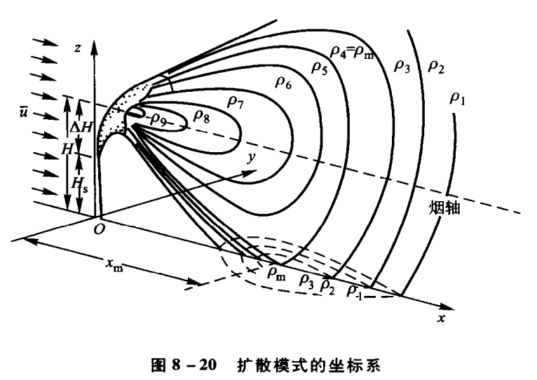
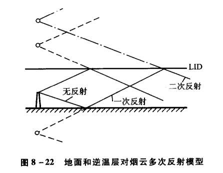
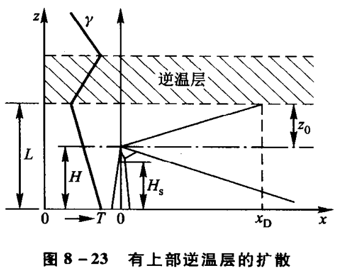
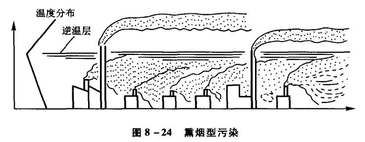
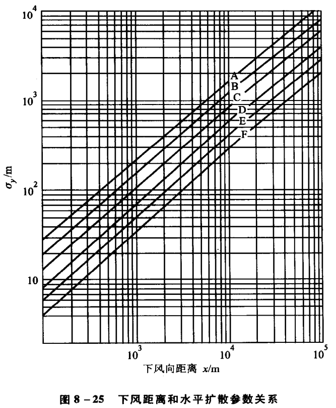
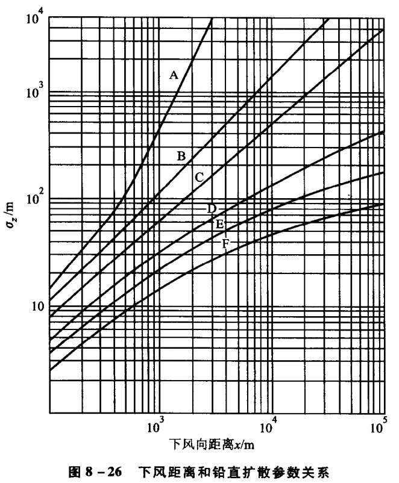
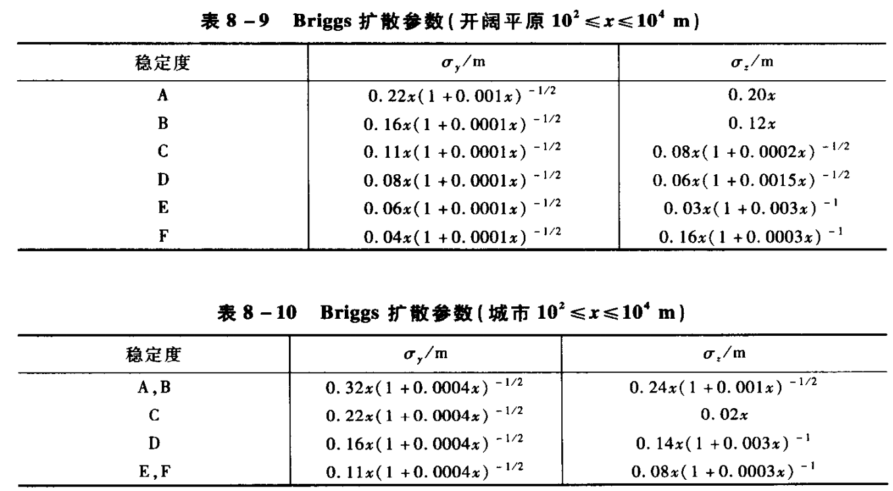
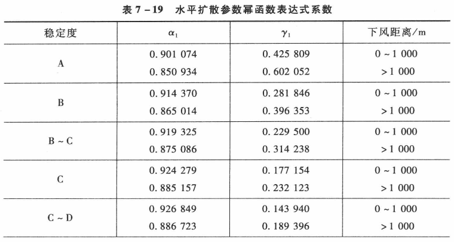
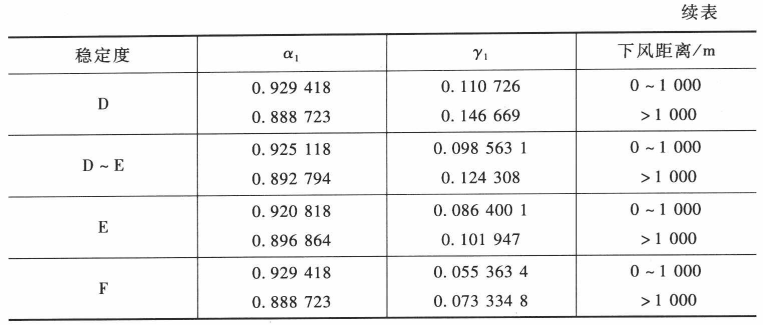
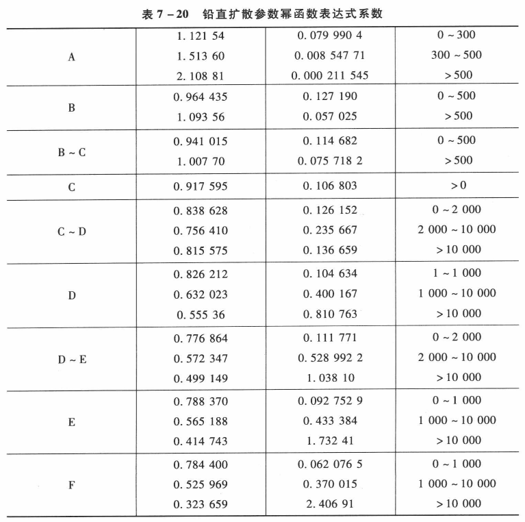

### 6.3 污染物落地浓度计算（三）污染物的落地浓度

#### 6.3.1 高斯扩散模式的基本形式

##### 6.3.1.1 高斯模式的坐标系

- 烟囱出口虽然都有一定大小，但只要不是讨论很近距离的污染问题，实用中都可以把它看作"点"源。在考虑这种理想化的点源坐标系时，总是将点源设于地面排放点或高架源排放点在地面的投影点，x轴沿平均风向水平延伸，y轴在水平面上垂直于x轴，z轴垂直xOy平面向上延伸。烟云中心平均路径沿x轴或平行x轴移动。下面介绍的模式都是在这种坐标系中导出的。

##### 6.3.1.2 高斯模式的有关假定

- 大量的试验和理论研究表明，对于连续源的平均烟流，其浓度分布是符合正态分布的，高斯扩散模式正是在污染物浓度符合正态分布的前提下导出的。
- 其基本假设为：
- - 烟羽的扩散在水平方向和垂直方向都是正态分布.
  - 在扩散的整个空间风速是均匀、稳定的。
  - 污染源排放是连续、均匀的。
  - 污染物在扩散过程中没有衰减和增生。
  - 在x方向，平流作用远大于扩散作用。
  - 地面足够平坦。

- 从这些假定出发，可以导出高斯扩散模式。

##### 6.3.1.3 无界情况的高斯模式

- 当污染源位于无界的空间中，x轴与烟流轴线重合时：

$$
\rho(x,y,z)=\frac{Q}{2\pi\overline{u}\sigma_y\sigma_z}exp\bigg[-\bigg(\frac{y^2}{2\sigma_y^2}+\frac{z^2}{2\sigma_z^2}\bigg)\bigg]\tag{3-1}
$$

- $\rho$：下风向空间某一位置的污染物浓度，$mg/m^3$。
- $\sigma_y$：y方向的标准差（水平扩散参数），$m$。
- $\sigma_x$：z方向的标准差（铅直扩散参数），$m$。
- $\overline{u}$：平均风速，$m/s$。
- $Q$：源强，$mg/s$。

##### 6.3.1.4 有界情况的高斯模式

- 当污染源位于有界的空间中，x轴与烟流轴线不重合时，必须考虑地面对扩散的影响。根据前述假定，污染物在扩散过程中无衰减和增生，那么地面对污染物没有吸收、吸附作用，可以认为地面像镜面一样，对污染物起全反射作用。
- 假设源在空间的坐标位置为(0,0,H)，虚源的位置则为(0,0,-H)：

$$
\rho(x,y,z,H)=\frac{Q}{2\pi\overline{u}\sigma_y\sigma_z}exp\bigg(-\frac{y^2}{2\sigma_y^2}\bigg){\times}\\\bigg\{exp\bigg[-\frac{(z-H)^2}{2\sigma_z^2}\bigg]+exp\bigg[-\frac{(z+H)^2}{2\sigma_z^2}\bigg]\bigg\}\tag{3-2}
$$

- $H$的意义见式（2-1）。
- 式（3.2）即为通常所说的高斯扩散模式，也是**高架连续点源扩散**的基本公式。

#### 6.3.2 一般气象条件下的扩散模式

##### 6.3.2.1 高架连续点源

###### 6.3.2.1.1 地面任意一点的浓度

- 将$z=0$代入式（3-2）：

$$
\rho(x,y,0,H)=\frac{Q}{\pi\overline{u}\sigma_y\sigma_z}exp\bigg(-\frac{y^2}{2\sigma_y^2}\bigg)exp\bigg(-\frac{H^2}{2\sigma_z^2}\bigg)\tag{3-3}
$$

###### 6.3.2.1.2 地面轴线浓度

- 将$y=0$代入式（3-3）：

$$
\rho(x,0,0,H)=\frac{Q}{\pi\overline{u}\sigma_y\sigma_z}exp\bigg(-\frac{H^2}{2\sigma_z^2}\bigg)\tag{3-4}
$$

###### 6.3.2.1.3 地面轴线最大浓度

- 由于扩散参数$\sigma_y$和$\sigma_z$均随下风距离$x$的增大而增大。
- 由式（3-4）可知：
- - 等号右边$Q/({\pi\overline{u}\sigma_y\sigma_z})$项随$x$的增大而减小。
  - $exp(-H^2/2\sigma_z^2)$项则随$x$增大而增大。

- 两项共同作用的结果，必然在下风某一距离$x_m$处出现地面轴线浓度的最大值。
- 假定$\sigma_y$和$\sigma_z$随$x$增大的倍数相同，即$\sigma_y/\sigma_z=k$（常数）。
- 代人式（3-4）后，便得到一个关于$\sigma_z$的单值函数式。
- 然后对$\sigma_z$求导，并令$d\rho/d\sigma_z=0$，则可得出地面轴线最大浓度$\rho_{max}$和出现$\rho_{max}$处的垂直扩散参数$\sigma_z\big|_{x=x_{max}}$的计算式：

$$
\rho_{max}=\frac{2Q}{\pi\overline{u}eH^2}\frac{\sigma_z}{\sigma_y}\tag{3-5}
$$

$$
\sigma_z\big|_{x=x_{max}}=\frac{H}{\sqrt{2}}\tag{3-6}
$$

- $e$：自然对数的底，$e=2.718$。
- 由于$\sigma_z$是距离的函数，故式（3-5）表示了最大浓度点与源高的关系。

##### 6.3.2.2 地面连续点源

###### 6.3.2.2.1 地面连续源在下风向地面上任一点的浓度

- 将$H=0$代入式（3-2）：

$$
\rho(x,y,0,0)=\frac{Q}{2\pi\overline{u}\sigma_y\sigma_z}exp\bigg[-\bigg(\frac{y^2}{2\sigma_y^2}+\frac{z^2}{2\sigma_z^2}\bigg)\bigg]\tag{3-7}
$$

###### 6.3.2.2.2 地面连续点源在下风向地面轴线浓度：

- 将$y=0$代入式（3-7）：

$$
\rho(x,0,0,0)=\frac{Q}{2\pi\overline{u}\sigma_y\sigma_z}\tag{3-8}
$$

#### 6.3.3 特殊气象条件下的扩散模式

##### 6.3.3.1 有上部逆温层的扩散模式

- 如果大气低层处于不稳定状态，而某一高度以上有逆温层存在，这时上部逆温层就像一个“盖子”一样使污染物垂直扩散受到限制，扩散只能在地面和逆温层之间进行，所以又称为“封闭型”扩散。
- 推导这种扩散模式时，把逆温层底面看成和地面一样能起反射的镜面，污染物浓度可看成实源和无穷多对虚源作用之总和。这样，空间任一点的浓度可由下式确定：

$$
\rho(x,y,z,H)=\frac{Q}{2\pi\overline{u}\sigma_y\sigma_z}exp\bigg(-\frac{y^2}{2\sigma_y^2}\bigg){\times}\\\sum^{+\infty}_{n=-\infty}\bigg\{exp\bigg[-\frac{(z-H+2nL)^2}{2\sigma_z^2}\bigg]+exp\bigg[-\frac{(z+H+2nL)^2}{2\sigma_z^2}\bigg]\bigg\}\tag{3-9}
$$

- - $L$：逆温层高度，m。
  - $n$：—烟流在两界面之间的反射次数，一般n=3或4时已包括主要反射。
- 这个公式过于繁琐，实际中可作如下的简化处理：设$x_D$为烟羽边缘刚好达逆温层底时离烟源的水平距离，则：

- 当$x<x_D$时，烟流扩散不受逆温影响，仍可采用式（3-2）进行计算。
- 当$x≥2x_D$时，污染物经过多次反射后，在z方向的浓度逐渐均匀，水平方向仍呈正态分布：
- - 地面浓度的计算公式为：

$$
\rho(x,y,0,H)=\frac{Q}{\sqrt{2\pi}L\overline{u}\sigma_y}exp\bigg(-\frac{y^2}{2\sigma_y^2}\bigg)\tag{3-10}
$$

- - 地面轴线浓度公式为：

$$
\rho(x,0,0,H)=\frac{Q}{\sqrt{2\pi}L\overline{u}\sigma_y}\tag{3-11}
$$

- 当$x_D<x<2x_D$时，有浓度和距离的双对数坐标图上，取$x=x_D$和$x=2x_D$两点浓度的内插值。

##### 6.3.3.2 熏烟扩散模式

- 夜间，若形成了辐射逆温，高架源的烟流排入稳定的逆温层中，垂直扩散很缓慢，在源高的下风向形成一个扇形污染区。日出后，辐射逆温层自下而上消失。当逆温消退到烟流下界时，污秽的烟气迅速向下扩散，此时上部仍为逆温，扩散只能向下发展，造成地面高浓度污染，这就是熏烟型扩散。

- 该过程持续发展，当逆温消退到烟流顶部时达到高潮。逆温继续向上消退后，烟气完全处于不稳定气层中，扩散在各个方向自由发展，原先的高浓度区不复存在，熏烟过程终止。熏烟型扩散一般发生在清晨，持续时间视各地情况及季节不同而异，一般为0.5~2h。
- 熏烟污染过程的浓度计算有以下几种模式（以下各式中下标$f$）代表熏烟：

###### 6.3.3.2.1 模式一

- 当逆温刚消退到烟流顶高（$L_f$）时，可认为全部烟羽受上部逆温的抑制而向下混合。此时地面浓度公式可由式（3-10）导出，只是L应换成逆温消失高度（$L_f$）。
- 地面熏烟浓度：

$$
\rho_f(x,y,0,H)=\frac{Q}{\sqrt{2\pi}L_f\overline{u}\sigma_{yf}}exp\bigg(-\frac{y^2}{2\sigma_{yf}^2}\bigg)\tag{3-12}
$$

- 轴线熏烟浓度：

$$
\rho_f(x,0,0,H)=\frac{Q}{\sqrt{2\pi}L_f\overline{u}\sigma_{yf}}\tag{3-13}
$$

- 式中：

$$
L_f=H+2.15\sigma_z(稳定)\tag{3-14}
$$

$$
\sigma_{yf}=\sigma_y(稳定)+\frac{H}{8}\tag{3-15}
$$

###### 6.3.3.2.2 模式二

- 若逆温消退到高度$z_f$，而$H<z_f<L$，此时只有$z_f$以下的烟气向下扩散，源强Q只包括$z_f$以下的部分，则地面浓度为：

$$
\rho_f(x,y,0,H)=\frac{Q\int\frac{1}{\sqrt{2\pi}}exp\big(-\frac{1}{2}p^2\big)dp}{\sqrt{2\pi}z_f\overline{u}\sigma_{yf}}exp\bigg(-\frac{y^2}{2\sigma_{yf}^2}\bigg)\tag{3-16}
$$

- 式中：

$$
p=\frac{z_f-H}{\sigma_z}\tag{3-17}
$$

###### 6.3.3.2.3 模式三

- 若逆温消退到有效源高$H$，即$z_f=H$，$p=0$，上式积分项等于$1/2$，表示有一半烟气向下扩散。
- 地面熏烟浓度：

$$
\rho_f(x,y,0,H)=\frac{Q}{2\sqrt{2\pi}H\overline{u}\sigma_{yf}}exp\bigg(-\frac{y^2}{2\sigma_{yf}^2}\bigg)\tag{3-18}
$$

- 地面轴线熏烟浓度：

$$
x \rho_f(x,0,0,H)=\frac{Q}{2\sqrt{2\pi}H\overline{u}\sigma_{yf}}\tag{3-19}
$$

#### 6.3.4 扩散参数的确定

- 从上述扩散模式可以看出，扩散参数$\sigma_y$、$\sigma_z$是估算大气污染物浓度的两个重要参数。
- 扩散参数直接与大气湍流性质有关，它的定量规律可以通过大气扩散理论研究和实验两方面获得。
- 但目前实用的扩散参数以实验资料为主要依据。通常$\sigma_y$和$\sigma_z$都是通过野外现场实验得到，再把这些数据表示为扩散距离、大气稳定度和下垫面粗糙度的函数，从而获得一些经验扩散参数公式。

##### 6.3.4.1 Passquill扩散参数

- Passquill在1961年推荐了一种仅需要常规气象观测资料就可以估算烟云扩散参数的方法。Gifford进一步将它制成应用更为方便的图表，因此这种方法又称**P-G曲线法**。
- 大气稳定度分类按Passquill分类法，**公式适用范围为下风向100km**。
- 图8-25和图8-26示出了不同稳定度下$\sigma_y$和$\sigma_z$随下风距离变化的经验曲线（取样时间10 min）。
- 一旦知道某地某时的大气稳定度，就可以从这些曲线上查到各下风距离$x$上的$\sigma_y$和$\sigma_z$值。
- 计算**地面轴线最大浓度***（$\rho_{max}$）和它出现的距离（$x_{max}$）时，可先按$\sigma_z=H/\sqrt{2}$ 计算出$\sigma_z\big|_{x=x_{max}}$，再从图8-26上查出对应的$x$值，此值即为该稳定度下的$x_{max}$，再从图8-25上查出与$x_{max}$对应的$\sigma_y$值，代入式（3-7）即可算出$\rho_{max}$值。

- 计算**非最大地面浓度**时，不能用$\sigma_z=H/\sqrt{2}$计算，而是根据下风距离$x$，由P-G曲线直接查得$\sigma_y$和$\sigma_z$，然后根据需要代入式（3-3）和式（3-4）进行计算。
- 为了克服从书刊资料中扩散曲线上确定$\sigma_y$和$\sigma_z$的误差，英国伦敦气象局给出了相应的查算表（表3-1），从这个表上可以用内插法求出在$20km$范围内的$\sigma_y$和$\sigma_z$值。

- Passquill这套数据适用于平原地区，对于粗糙度较大的地区，则应向不稳定方向提高1～2级后再查表或图。

##### 6.3.4.2 Briggs扩散参数

- Briggs在前人研究的基础上，考虑到下垫面和烟囱高度的影响，提出了一套估算平原地区和城市地区的扩散参数公式，这套公式对于高烟囱排放适用于下风向20~30km左右的范围。表8-9和表8-10分别列出了这套估算$\sigma_y$和$\sigma_z$的公式（取样时间30min）。

##### 6.3.4.3 国标推荐的扩散参数

- 若由6.1节查得或根据以下规则提级后稳定度为区间值且不在表7-19和表7-20里，则可取**稳定度相对更低的值**作为查表依据。

- **平原地区农村及城市远郊区**：A、B、C级稳定度直接由表7-19和表7-20查出扩散参数$\sigma_y$和$\sigma_z$幂指数，D、E、F级稳定度则需要向不稳定方向提半级后查算。
- **工业区或城区**：
- - 工业区A、B级不提级，C级提到B级，D、E、F级向不稳定方向提一级半。
  - 非工业区的城区，A、B 级不提级，C级提到B级或C级，D、E、F级向不稳定方向提一级。
  - 再查表7-19和表7-20。
- **丘陵山区的农村或城市**：同城市工业区。
- **表中参数**：
- - $\sigma_y={\gamma_1}x^{\alpha_1}$
  - $\sigma_z={\gamma_2}x^{\alpha_2}$

#### 6.3.5 影响浓度的时间因素

- 大气扩散模式所估算的污染物浓度都是在一定时间内的平均值。
- 实践证明，随着时间的延长，平均浓度将降低，这是由于取样时间延长，风的摆动增大，从而使横向扩散参数$\sigma_y$随取样时间而增大。
- 但垂直方向的扩散因受地面限制，当时间延长到10~20秒以后，$\sigma_z$就不随取样时间而增大了。
- 污染物平均浓度随取样时间延长而降低的这一特性叫做**时间稀释作用**，可用如下关系表示：

$$
\rho_1=\rho_2\bigg(\frac{t_2}{t_1}\bigg)^P\tag{3-20}
$$

$$
\sigma_{y2}=\sigma_{y1}\bigg(\frac{t_2}{t_1}\bigg)^P\tag{3-21}
$$

- $\rho_1,\rho_2$：分别对应取样时间为$t_1、t_2$时的浓度。
- $\sigma_{y1},\sigma_{y2}$：分别对应取样时间为$t_1、t_2$时的水平扩散参数。
- $P$：时间稀释指数，查表3-2.

<table>
	<tr>
		<th colspan=6 style="text-align:center">表3-2 国标推荐的P值取法</th>
	</tr>
	<tr>
		<th style="text-align:center">稳定度</th>
		<th style="text-align:center">B</th>
		<th style="text-align:center">B~C</th>
		<th style="text-align:center">C</th>
		<th style="text-align:center">C~D</th>
		<th style="text-align:center">D</th>
	</tr>
	<tr>
		<td style="text-align:center">t=0.5~2h</td>
		<td style="text-align:center">0.27</td>
		<td style="text-align:center">0.29</td>
		<td style="text-align:center">0.31</td>
		<td style="text-align:center">0.32</td>
		<td style="text-align:center">0.35</td>
	</tr>	
	<tr>
		<td style="text-align:center">t=2~24h</td>
		<td style="text-align:center">0.36</td>
		<td style="text-align:center">0.39</td>
		<td style="text-align:center">0.42</td>
		<td style="text-align:center">0.45</td>
		<td style="text-align:center">0.48</td>
	</tr>	
</table>	